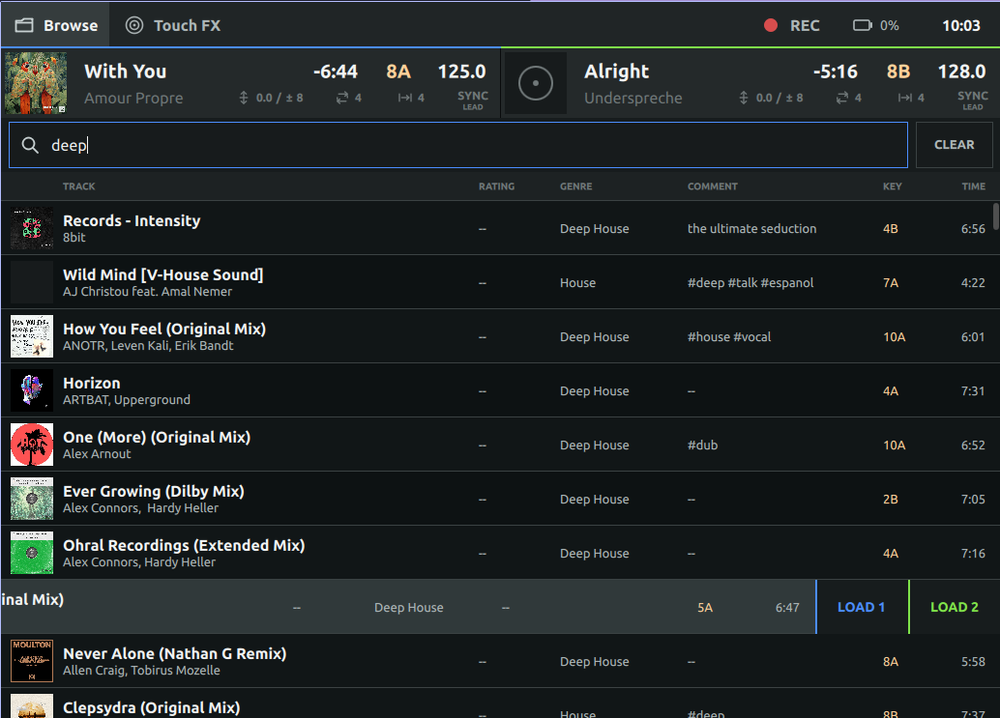
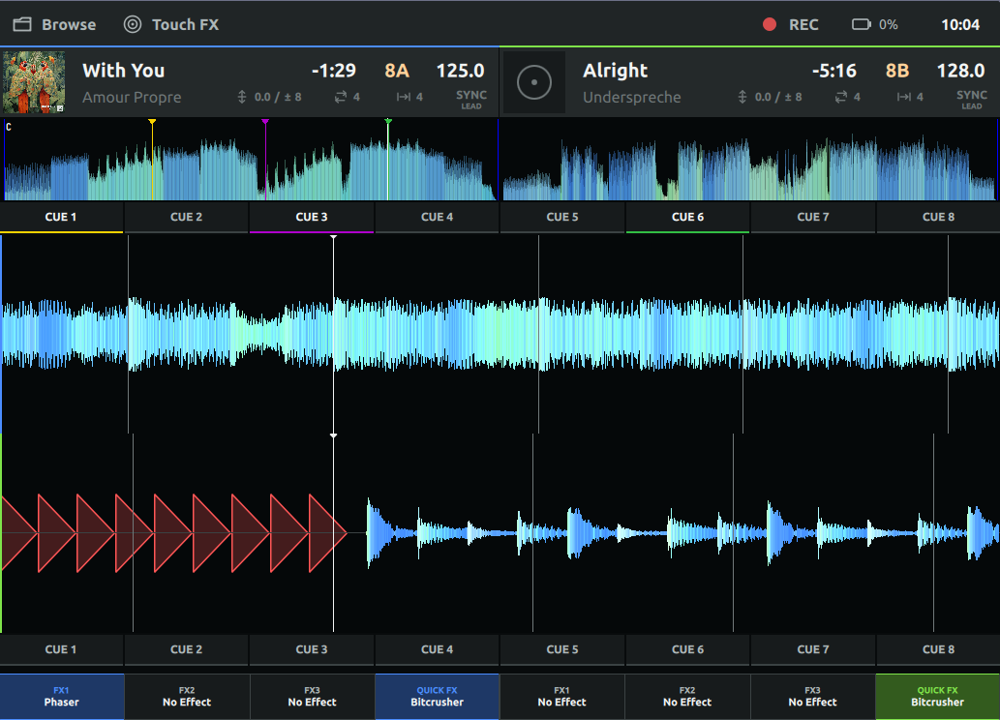

# TouchQML for Mixxx

Experimental touch-first QML skin for Mixxx. It targets two-deck workflows on
landscape touchscreens from 1024 x 600 through 1920 x 1080 logical pixels.

TouchQML currently provides:

- Fixed navigation, deck status, and full-track overview rows
- Stacked RGB scrolling waveforms with beat, cue, hotcue, and loop markers
- Full-width 1 x 8 hotcue strips around the waveforms with indexed cue colors
- Per-deck standard and Quick Effect toggles with hold-to-select menus
- Live metadata, BPM, pitch, key, time, loop, beat-jump, and sync state
- Touch-native library browsing, filtering, and load-to-deck actions
- Original dark theme and SVG icons
- Keyboard shortcuts for Preferences (`Ctrl+P`) and Quit (`Ctrl+Q`)

The skin remains a developer preview. Transport, mixer, additional performance
pad modes, detailed effect controls, and source/playlist navigation are
incomplete.

## Screenshots

### Performance



### Browse



## Requirements

- A recent development build of Mixxx with Qt 6 and QML enabled
- Mixxx's experimental configured-QML-skin support
- Developer mode when discovering and running the skin

This skin uses the compiled `Mixxx 1.0` and `Mixxx.Controls 1.0` modules. These
APIs are experimental and are not yet a stable third-party skin contract.

## Installation

Place this repository in a Mixxx user `skins` directory under the stable
directory name `TouchQML`. For a local checkout on Linux:

```sh
mkdir -p ~/.mixxx/skins
ln -s "$(pwd)" ~/.mixxx/skins/TouchQML
```

Alternatively, copy the repository contents so these files exist:

```text
~/.mixxx/skins/TouchQML/main.qml
~/.mixxx/skins/TouchQML/skin.ini
```

Start Mixxx with developer mode, select `Touch QML (Experimental)` in
Preferences > Interface, then restart Mixxx with developer mode:

```sh
mixxx --developer
```

Do not use `--new-ui`; that starts Mixxx's separate standalone QML frontend
instead of the configured skin.

## Repository Layout

- `main.qml`: application window and top-level view switching
- `NavigationBar.qml`: global navigation and status actions
- `Controls/`: reusable skin controls
- `Deck/`: deck metadata, sync, and waveform overview components
- `Library/`: touch-native track browser and rows
- `Performance/`: replaceable performance page and scrolling waveforms
- `Theme/`: colors, typography, dimensions, and QML module metadata
- `Icons/`: original monochrome SVG assets
- `docs/architecture.md`: Mixxx QML-skin architecture and TouchQML state
- `docs/design.md`: original design brief and acceptance criteria

## Development

Keep skin implementation self-contained. Prefer named `Mixxx` and
`Mixxx.Controls` APIs over relative imports into a Mixxx source checkout.
Changes should remain usable when this repository is installed in the user
skins directory.

See `docs/architecture.md` before changing controls or application behavior.
See `docs/design.md` for layout, interaction, and viewport requirements.

## License

TouchQML is distributed under the GNU General Public License, version 2 or (at
your option) any later version. See `LICENSE`.
